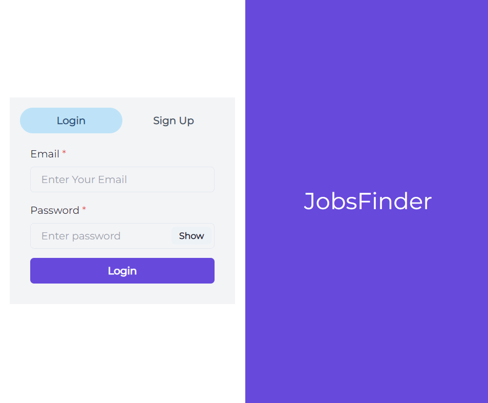

# JobsFinder - Single platform for jobs, chats, interview prep & more

- This is a community, jobs search, collaboration & interview preparation platform.
- This is a full-stack end-to-end app providing one stop solution for job seekers.
- It uses socket.io for real-time communication, one on one messaging and live coding sessions.
- Stores the user's details in encrypted format in the MongoDB database.
- JWT with token expiry for user authentication.

## Tech Stack

- React.js, Chakra UI, Material UI
- Express.js, Node.js 
- MongoDB, Moongose 
- Socket.io
- Tailwind CSS
## Project Screenshots:

### User Module:

### Admin Module:

